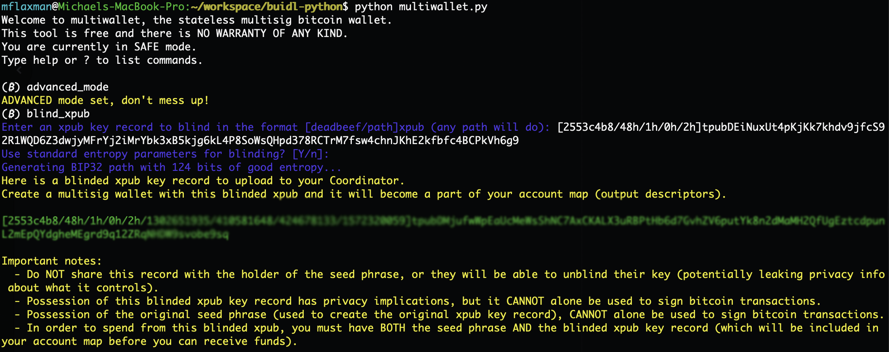
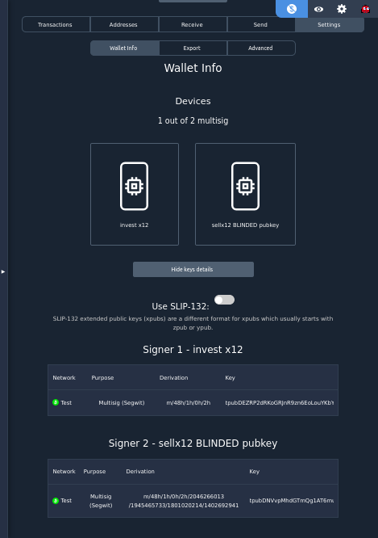

# Blinding A Seed Phrase Using Massive BIP32 Paths

## Intro

Bitcoin's multisig security model is a breakthrough in human being's ability to self-custody value.
However, having multiple seeds floating around that convey information about what they're protecting introduces new risks.
A holder of a standard seed phrase used in a `4-of-7` multisig wallet can learn substantial information about what they're protecting.
This can introduce new security risks, as well as provide a choke-point for governments to gain access to information about private holdings.

While multisig offers unrivaled security to HODLers, one of the biggest bariers to adoption is the need for having multiple secure locations.
A scheme that enable 1 (or more) semi-trusted collaborative custodians (e.g. a lawyer, accountant, heir, close friend, "uncle Jim" bitcoiner, collaborative custody service, etc) to participate in a multisig quorum with *zero* knowledge of what they're protecting could increase multisig adoption and reduce hacks/theft/loss in the bitcoin space.

## Tech Overview

For this demo, we'll use [Specter-Desktop](https://github.com/cryptoadvance/specter-desktop/) (powered by bitcoin core) as it's the de-facto standard for almost all new soverign multisig users today.
We'll also duplicate the code in [buidl](https://github.com/buidl-bitcoin/buidl-python) as it's a no-dependency bitcoin implementaiton written in python that is very easy to use.
For simplicity, we are going to blind just `1` seed phrase in a `1-of-2`, but it should be obvious how to expand this to a `2-of-3`, `3-of-5`, or other scheme.
At the end, we'll discuss implications for blinding up to `m` seed phrases.

## Buidl Setup for Verification (not required)
Easiest way
```
$ pip install buidl-python && python3
```

More secure way:
```
$ git clone https://github.com/buidl-bitcoin/buidl-python.git && cd buidl-python && python3
```
(because `buidl` has no dependencies and is designed for simple airgap use, you don't need to install it)

Most of these verification steps can be performed with other open-source libraries, and we'll call out to them as well.

## Generate 2 Seed Phrases
Let’s assume that seed phrase A is held by (and generated by) me and seed B is held by (and generated by) a semi-trusted third party (e.g. a lawyer, accountant, heir, close friend, "uncle Jim" bitcoiner, collaborative custody service, etc).

### Seed Phrase A
```
BIP39 Seed Phrase (invest repeated 12x):
invest invest invest invest invest invest invest invest invest invest invest invest

Public Key Record (from hardware wallet) in SLIP132 encoding:
[aa917e75/48h/1h/0h/2h]Vpub5mRMNhCLt7nNky1SpXzt1KdLb4FGKTTQuPxcG3MygnWyGTD87fYmK4tfyfgLahhb5SYanobvk1Zis676QSsGMjVQ9xz9QQcYsizJDq1xzxT

Public Key Record (from hardware wallet) without SLIP132 encoding:
[aa917e75/48h/1h/0h/2h]tpubDEZRP2dRKoGRJnR9zn6EoLouYKbYyjFsxywgG7wMQwCDVkwNvoLhcX1rTQipYajmTAF82kJoKDiNCgD4wUPahACE7n1trMSm7QS8B3S1fdy
```

### Seed Phrase B
```
BIP39 Seed Phrase (sell repeated x12):
sell sell sell sell sell sell sell sell sell sell sell sell

Public Key Record (from hardware wallet) in SLIP132 encoding:
[2553c4b8/48h/1h/0h/2h]Vpub5maJud3od8qgmvi3XPpnweRsBm4ir8QdVTesjtmt8Q3nV48HncG1sddZCMhr6W6GRoAs3svAXvGZ8GF98rQkHH5UMtCHJimTNNjNSWZUapk

Public Key Record (from hardware wallet) without SLIP132 encoding:
[2553c4b8/48h/1h/0h/2h]tpubDEiNuxUt4pKjKk7khdv9jfcS92R1WQD6Z3dwjyMFrYj2iMrYbk3xB5kjg6kL4P8SoWsQHpd378RCTrM7fsw4chnJKhE2kfbfc4BCPkVh6g9
```

### Verification

This could be generated in build as follows:
```
$ python3
>>> from buidl.hd import HDPrivateKey
>>> HDPrivateKey.from_mnemonic("invest " * 12, testnet=True).generate_p2wsh_key_record()
'[aa917e75/48h/1h/0h/2h]Vpub5mRMNhCLt7nNky1SpXzt1KdLb4FGKTTQuPxcG3MygnWyGTD87fYmK4tfyfgLahhb5SYanobvk1Zis676QSsGMjVQ9xz9QQcYsizJDq1xzxT'
>>> HDPrivateKey.from_mnemonic("sell " * 12, testnet=True).generate_p2wsh_key_record()
'[2553c4b8/48h/1h/0h/2h]Vpub5maJud3od8qgmvi3XPpnweRsBm4ir8QdVTesjtmt8Q3nV48HncG1sddZCMhr6W6GRoAs3svAXvGZ8GF98rQkHH5UMtCHJimTNNjNSWZUapk'
```

Note that we use SLIP132 version byte encoding to communicate unambiguously that we are P2WSH on testnet, but if you/your Coordinator software is smart then regular xpub/tpub can work great as well.
`buidl` supports any version byte, and [Jameson Lopp's convenient xpub converter](https://jlopp.github.io/xpub-converter/) can also convert for you if needed.

## Blind 1 Seed Phrase

We blind seed B only using `buidl`'s built in [multiwallet.py](https://twitter.com/mflaxman/status/1321503036724989952).
Remember that Seed Phrase B is held by our semi-trusted third party.

```
$ python3 multiwallet.py 
Welcome to multiwallet, the stateless multisig bitcoin wallet.
This tool is free and there is NO WARRANTY OF ANY KIND.
You are currently in SAFE mode.
Type help or ? to list commands.

(₿) advanced_mode
ADVANCED mode set, don't mess up!
(₿) blind_xpub
Enter an xpub key record to blind in the format [deadbeef/path]xpub (any path will do): [2553c4b8[2553c4b8/48h/1h/0h/2h]Vpub5maJud3od8qgmvi3XPpnweRsBm4ir8QdVTesjtmt8Q3nV48HncG1sddZCMhr6W6GRoAs3svAXvGZ8GF98rQkHH5UMtCHJimTNNjNSWZUapk
Use standard entropy parameters for blinding? [Y/n]: 
Generating BIP32 path with 124 bits of good entropy...
Here is a blinded xpub key record to upload to your Coordinator.
Create a multisig wallet with this blinded xpub and it will become a part of your account map (output descriptors).

[2553c4b8/48h/1h/0h/2h/2046266013/1945465733/1801020214/1402692941]Vpub5uMrp2GYpnHN8BkjvXpP71TuZ8BDqu61PPcwEKSzE9Mcuow727mUJNsDsKdzAiupHXea5F7ZxD9SaSQvbr1hvpNjrijJQ2J46VQjc5yEcm8

Important notes:
  - Do NOT share this record with the holder of the seed phrase, or they will be able to unblind their key (potentially leaking privacy info about what it controls).
  - Possession of this blinded xpub key record has privacy implications, but it CANNOT alone be used to sign bitcoin transactions.
  - Possession of the original seed phrase (used to create the original xpub key record), CANNOT alone be used to sign bitcoin transactions.
  - In order to spend from this blinded xpub, you must have BOTH the seed phrase AND the blinded xpub key record (which will be included in your account map before you can receive funds).
```

This looks better in the CLI app with nice colors:


### Verification

You can validate on this on an airgap computer using [Ian Coleman’s popular open-source tool](https://iancoleman.io/bip39/) and [Jameson Lopp's xpub converter for SLIP132 version byte encoding](https://jlopp.github.io/xpub-converter/).

[Here is a screenshot of proving accuracy of this derivation path](blinding_from_vpub.png).

For the avoidance of any doubt, [here is a screenshot assuming you have access to their seed phrase](blinding_from_seed_phrase.png) (SLIP132 version byte encoding [here](blinded_tpub_to_vpub.png).

## Create Account Map

In our case, we take the regular seed phrase A xpub (see [Seed Phrase A](#Seed-Phrase-A) above) and the blinded Seed Phrase B xpub we just calculated (see [Blind 1 Seed Phrase](#Blind-1-Seed-Phrase) above) and combine them into a `1-of-2 p2wsh sortedmulti` using Specter-Desktop:


That will also generate [this account map PDF backup](investx12_sellx12_blinded_backup.pdf) (account map only [here](account_map.png)).

### buidl Verification

We run the following code in python:
```
from buidl.descriptor import P2WSHSortedMulti

quorum_m = 1
key_records = [
    {
        # investx12 - regular path
        "xfp": "aa917e75",
        "path": "m/48h/1h/0h/2h",
        "xpub_parent": "tpubDEZRP2dRKoGRJnR9zn6EoLouYKbYyjFsxywgG7wMQwCDVkwNvoLhcX1rTQipYajmTAF82kJoKDiNCgD4wUPahACE7n1trMSm7QS8B3S1fdy",
        "account_index": 0,
    },
    {
        # sellx12 - BLINDED path
        "xfp": "2553c4b8",
        "path": "m/48h/1h/0h/2h/2046266013/1945465733/1801020214/1402692941",
        "xpub_parent": "Vpub5uMrp2GYpnHN8BkjvXpP71TuZ8BDqu61PPcwEKSzE9Mcuow727mUJNsDsKdzAiupHXea5F7ZxD9SaSQvbr1hvpNjrijJQ2J46VQjc5yEcm8",
        "account_index": 0,
    },
]
p2wsh_sortedmulti_obj = P2WSHSortedMulti(quorum_m, key_records)
print(p2wsh_sortedmulti_obj)
```

Results:
```
wsh(sortedmulti(1,[aa917e75/48h/1h/0h/2h]tpubDEZRP2dRKoGRJnR9zn6EoLouYKbYyjFsxywgG7wMQwCDVkwNvoLhcX1rTQipYajmTAF82kJoKDiNCgD4wUPahACE7n1trMSm7QS8B3S1fdy/0/*,[2553c4b8/48h/1h/0h/2h/2046266013/1945465733/1801020214/1402692941]tpubDNVvpMhdGTmQg1AT6muju2eUWPXWWAtUSyc1EQ2MxJ2s97fMqFZQbpzQM4gU8bwzfFM7KBpSXRJ5v2Wu8sY2GF5ZpXm3qy8GLArZZNM1Wru/0/*))#0lfdttke
```

## Get Receive Address

### Specter-Desktop

Powered by Bitcoin Core, we see the following address:


### buidl Validation
```
>>> p2wsh_sortedmulti_obj.get_address(0)
'tb1q6d6frh07dl8djmnv48aqelp6r0mejzh7qgauw7yx5qcjehvcfnsqxc6lly'
```

Using a testnet faucet, we send some TBTC to this address:
<https://blockstream.info/testnet/tx/67eed0727a639f214b3da3ee206b2a27ed8cd8aca6ccd795972da5bc33dc4d35>

## Sign Transaction Using Blinded Key
To spend from this multisig, only one seed (A or B) and the complete account map is required.

We will return the funds to the testnet faucet address:
`mkHS9ne12qx9pS9VojpwU5xtRd4T7X7ZUt`

### Specter-Desktop

Specter-Desktop builds us an unsigned PSBT to sweep these funds:


The corresponding PSBT it displays is:
```
cHNidP8BAFUCAAAAATVN3DO8pS2XldfMpqzYjO0nKmsg7qM9SyGfY3py0O5nAAAAAAD9////ASWGAQAAAAAAGXapFDRKD0jKFQ7CuQOBdmC5tosTpnAmiKwAAAAAAAEAlAIAAAABuyYafpgmVz6R0nydIwQhLhK9wyq+MdzpZ2eYwfXFb0sAAAAAFxYAFNeBq/yMVx5pEh75uUCeQEenBts2/v///wKghgEAAAAAACIAINN0kd3+b87Zbmyp+gz8Ohv3mQr+AjvHeIagMSzdmEzgRxk5AAAAAAAWABSximIn3PYA1OH6B/cCwK+yIu8LAFKOHgABASughgEAAAAAACIAINN0kd3+b87Zbmyp+gz8Ohv3mQr+AjvHeIagMSzdmEzgAQVHUSEDELg0dGMOr13U7TYY21H1qqau+SG9gzPtgUOqbqcdjU0hAz8uRBD7XX0++TpuqGBjHSbo0olYV8KAZj3e9ovghmHxUq4iBgMQuDR0Yw6vXdTtNhjbUfWqpq75Ib2DM+2BQ6pupx2NTSwlU8S4MAAAgAEAAIAAAACAAgAAgJ2K93mFc/VzNmNZa01lm1MAAAAAAAAAACIGAz8uRBD7XX0++TpuqGBjHSbo0olYV8KAZj3e9ovghmHxHKqRfnUwAACAAQAAgAAAAIACAACAAAAAAAAAAAAAAA==
```
(PSBT image version for airgap signers [here](psbt.png))

### Buidl

```
$ python3 multiwallet.py 
Welcome to multiwallet, the stateless multisig bitcoin wallet.
This tool is free and there is NO WARRANTY OF ANY KIND.
You are currently in SAFE mode.
Type help or ? to list commands.

(₿) send
Paste in your account map (AKA output record): wsh(sortedmulti(1,[aa917e75/48h/1h/0h/2h]tpubDEZRP2dRKoGRJnR9zn6EoLouYKbYyjFsxywgG7wMQwCDVkwNvoLhcX1rTQipYajmTAF82kJoKDiNCgD4wUPahACE7n1trMSm7QS8B3S1fdy/0/*,[2553c4b8/48h/1h/0h/2h/2046266013/1945465733/1801020214/1402692941]tpubDNVvpMhdGTmQg1AT6muju2eUWPXWWAtUSyc1EQ2MxJ2s97fMqFZQbpzQM4gU8bwzfFM7KBpSXRJ5v2Wu8sY2GF5ZpXm3qy8GLArZZNM1Wru/0/*))#0lfdttke
Paste partially signed bitcoin transaction (PSBT) in base64 form: cHNidP8BAFUCAAAAATVN3DO8pS2XldfMpqzYjO0nKmsg7qM9SyGfY3py0O5nAAAAAAD9////ASWGAQAAAAAAGXapFDRKD0jKFQ7CuQOBdmC5tosTpnAmiKwAAAAAAAEAlAIAAAABuyYafpgmVz6R0nydIwQhLhK9wyq+MdzpZ2eYwfXFb0sAAAAAFxYAFNeBq/yMVx5pEh75uUCeQEenBts2/v///wKghgEAAAAAACIAINN0kd3+b87Zbmyp+gz8Ohv3mQr+AjvHeIagMSzdmEzgRxk5AAAAAAAWABSximIn3PYA1OH6B/cCwK+yIu8LAFKOHgABASughgEAAAAAACIAINN0kd3+b87Zbmyp+gz8Ohv3mQr+AjvHeIagMSzdmEzgAQVHUSEDELg0dGMOr13U7TYY21H1qqau+SG9gzPtgUOqbqcdjU0hAz8uRBD7XX0++TpuqGBjHSbo0olYV8KAZj3e9ovghmHxUq4iBgMQuDR0Yw6vXdTtNhjbUfWqpq75Ib2DM+2BQ6pupx2NTSwlU8S4MAAAgAEAAIAAAACAAgAAgJ2K93mFc/VzNmNZa01lm1MAAAAAAAAAACIGAz8uRBD7XX0++TpuqGBjHSbo0olYV8KAZj3e9ovghmHxHKqRfnUwAACAAQAAgAAAAIACAACAAAAAAAAAAAAAAA==
Transaction appears to be a testnet transaction. Display as testnet? [Y/n]: 
PSBT sends 99,877 sats to mkHS9ne12qx9pS9VojpwU5xtRd4T7X7ZUt with a fee of 123 sats (0.12% of spend)
In Depth Transaction View? [y/N]: 
Sign this transaction? [Y/n]: 
Enter your full BIP39 seed phrase: sell sell sell sell sell sell sell sell sell sell sell sell
Use a passphrase (advanced users only)? [y/N]: 

Signed PSBT to broadcast:

cHNidP8BAFUCAAAAATVN3DO8pS2XldfMpqzYjO0nKmsg7qM9SyGfY3py0O5nAAAAAAD9////ASWGAQAAAAAAGXapFDRKD0jKFQ7CuQOBdmC5tosTpnAmiKwAAAAAAAEAlAIAAAABuyYafpgmVz6R0nydIwQhLhK9wyq+MdzpZ2eYwfXFb0sAAAAAFxYAFNeBq/yMVx5pEh75uUCeQEenBts2/v///wKghgEAAAAAACIAINN0kd3+b87Zbmyp+gz8Ohv3mQr+AjvHeIagMSzdmEzgRxk5AAAAAAAWABSximIn3PYA1OH6B/cCwK+yIu8LAFKOHgAiAgMQuDR0Yw6vXdTtNhjbUfWqpq75Ib2DM+2BQ6pupx2NTUcwRAIgXtCGNahJyDarwItTjAHVIzOs2DZeeGpdofBwLGmKJj0CIFA3+mNpLZ/c+KOcs41hRyY5w/08BH0ENzxEFWnIuhG4AQEFR1EhAxC4NHRjDq9d1O02GNtR9aqmrvkhvYMz7YFDqm6nHY1NIQM/LkQQ+119Pvk6bqhgYx0m6NKJWFfCgGY93vaL4IZh8VKuIgYDELg0dGMOr13U7TYY21H1qqau+SG9gzPtgUOqbqcdjU0sJVPEuDAAAIABAACAAAAAgAIAAICdivd5hXP1czZjWWtNZZtTAAAAAAAAAAAiBgM/LkQQ+119Pvk6bqhgYx0m6NKJWFfCgGY93vaL4IZh8RyqkX51MAAAgAEAAIAAAACAAgAAgAAAAAAAAAAAAAA=
```
(easier to view screenshot [here](multiwallet_sellx12_blinded_spend.png))

## Sign Transaction Using Regular Key
This is standard, so we will only demonstrate it quickly with `multiwallet.py`.
You could use any hardware wallet that had the seed `invest invest invest...` (x12).

```
$ python3 multiwallet.py 
Welcome to multiwallet, the stateless multisig bitcoin wallet.
This tool is free and there is NO WARRANTY OF ANY KIND.
You are currently in SAFE mode.
Type help or ? to list commands.

(₿) send
Paste in your account map (AKA output record): wsh(sortedmulti(1,[aa917e75/48h/1h/0h/2h]tpubDEZRP2dRKoGRJnR9zn6EoLouYKbYyjFsxywgG7wMQwCDVkwNvoLhcX1rTQipYajmTAF82kJoKDiNCgD4wUPahACE7n1trMSm7QS8B3S1fdy/0/*,[2553c4b8/48h/1h/0h/2h/2046266013/1945465733/1801020214/1402692941]tpubDNVvpMhdGTmQg1AT6muju2eUWPXWWAtUSyc1EQ2MxJ2s97fMqFZQbpzQM4gU8bwzfFM7KBpSXRJ5v2Wu8sY2GF5ZpXm3qy8GLArZZNM1Wru/0/*))#0lfdttke
Paste partially signed bitcoin transaction (PSBT) in base64 form: cHNidP8BAFUCAAAAATVN3DO8pS2XldfMpqzYjO0nKmsg7qM9SyGfY3py0O5nAAAAAAD9////ASWGAQAAAAAAGXapFDRKD0jKFQ7CuQOBdmC5tosTpnAmiKwAAAAAAAEAlAIAAAABuyYafpgmVz6R0nydIwQhLhK9wyq+MdzpZ2eYwfXFb0sAAAAAFxYAFNeBq/yMVx5pEh75uUCeQEenBts2/v///wKghgEAAAAAACIAINN0kd3+b87Zbmyp+gz8Ohv3mQr+AjvHeIagMSzdmEzgRxk5AAAAAAAWABSximIn3PYA1OH6B/cCwK+yIu8LAFKOHgABASughgEAAAAAACIAINN0kd3+b87Zbmyp+gz8Ohv3mQr+AjvHeIagMSzdmEzgAQVHUSEDELg0dGMOr13U7TYY21H1qqau+SG9gzPtgUOqbqcdjU0hAz8uRBD7XX0++TpuqGBjHSbo0olYV8KAZj3e9ovghmHxUq4iBgMQuDR0Yw6vXdTtNhjbUfWqpq75Ib2DM+2BQ6pupx2NTSwlU8S4MAAAgAEAAIAAAACAAgAAgJ2K93mFc/VzNmNZa01lm1MAAAAAAAAAACIGAz8uRBD7XX0++TpuqGBjHSbo0olYV8KAZj3e9ovghmHxHKqRfnUwAACAAQAAgAAAAIACAACAAAAAAAAAAAAAAA==
Transaction appears to be a testnet transaction. Display as testnet? [Y/n]: 
PSBT sends 99,877 sats to mkHS9ne12qx9pS9VojpwU5xtRd4T7X7ZUt with a fee of 123 sats (0.12% of spend)
In Depth Transaction View? [y/N]: 
Sign this transaction? [Y/n]: 
Enter your full BIP39 seed phrase: invest invest invest invest invest invest invest invest invest invest invest invest
Use a passphrase (advanced users only)? [y/N]: 

Signed PSBT to broadcast:

cHNidP8BAFUCAAAAATVN3DO8pS2XldfMpqzYjO0nKmsg7qM9SyGfY3py0O5nAAAAAAD9////ASWGAQAAAAAAGXapFDRKD0jKFQ7CuQOBdmC5tosTpnAmiKwAAAAAAAEAlAIAAAABuyYafpgmVz6R0nydIwQhLhK9wyq+MdzpZ2eYwfXFb0sAAAAAFxYAFNeBq/yMVx5pEh75uUCeQEenBts2/v///wKghgEAAAAAACIAINN0kd3+b87Zbmyp+gz8Ohv3mQr+AjvHeIagMSzdmEzgRxk5AAAAAAAWABSximIn3PYA1OH6B/cCwK+yIu8LAFKOHgAiAgM/LkQQ+119Pvk6bqhgYx0m6NKJWFfCgGY93vaL4IZh8UcwRAIgQkob2Lo6SWrnmhf6iZAw0PSvd8UnSPNGqqQWJqKg88cCIB+wsr3dwv5OByCHEkS2IHR7aC0aYHPMz3CgX5XHeyP9AQEFR1EhAxC4NHRjDq9d1O02GNtR9aqmrvkhvYMz7YFDqm6nHY1NIQM/LkQQ+119Pvk6bqhgYx0m6NKJWFfCgGY93vaL4IZh8VKuIgYDELg0dGMOr13U7TYY21H1qqau+SG9gzPtgUOqbqcdjU0sJVPEuDAAAIABAACAAAAAgAIAAICdivd5hXP1czZjWWtNZZtTAAAAAAAAAAAiBgM/LkQQ+119Pvk6bqhgYx0m6NKJWFfCgGY93vaL4IZh8RyqkX51MAAAgAEAAIAAAACAAgAAgAAAAAAAAAAAAAA=
```
(easier to view screenshot [here](multiwallet_investx12_regular_spend.png))

## Why This Matters

At the time of seed generation up until revealing the account map (with secret BIP32 path), the holder of seed phrase B was unable to learn *anything* about what they were protecting:
* Transaction history (including any spent UTXOs) & balance
* Quorum information (`1-of-2` in this case)
* We establish a new trust boundary, explicitly separating privacy information (account map) from security information (private key material)

If the HODLer of this seed phrase were malicious or compelled by a government, they would not be able to reveal any privacy information.
Also, because this is built on top of existing BIP32 paths, it is *already* compatible with existing software.

Of course, this scheme requires that the account map get to the blinded key holder in the event they are needed for recovery.
More on this is below (see [Bigger Picture](#Bigger-Picture)).

## Bigger Picture

In this scheme, we've used large and randomly generated BIP32 paths to blind a single seed phrase in our quorum.
However, the same scheme could be applied to *every* seed phrase in our qourom.
This means that if an unauthorized party gains access to a single seed phrase (perhaps a single secure location is compromised), they learn *nothing* about what it protects nor what threshold is required for access.
Under current best-practices, if a bad actor gains unauthorized access to a single seed phrase they could perhaps learn the following:
* Yesterday that seed phrase was party to a massive transaction that likely had a large change ouput (note that this situation could be true even if this seed phrase did not sign in the transaction)
* The transaction that it was a party to (with likely large change back to itself) was a `2-of-3`, meaning that only 1 more seed phrase (along with the account map) is needed to spend funds.
Potential outcome: show up at this person's house or place of business with the seed phrase and a $5 wrench.

If wallets self-blinded their own seed phrases, it would be possible for the Coordinator software to keep track of the account map, and split it using Shamir'S Secret Sharing Scheme.
It would then be possible to have something like a `3-of-5` on-chain p2wsh multisig, where perhaps `2-of-n` (where n is a large number and unrelated to the `3-of-5` in the on-chain multisig) Shamir Shards are needed to recover the account map.
If an unauthorized party gained access to a single seed phrase, they'd know nothing about what it protects.

Even without blinding *all* seed phrases, this scheme still provides lots of value by allowing 1 seed phrase holder to participate 

### Compatibility

As of late May 2021, here is the compatibility of popular multisig hardware wallets:

| Device         | Co-Sign Standard Path | Sign Blinded Path |
|----------------|-----------------------|-------------------|
| Specter-DIY    | √                     | √                 |
| multiwallet.py | √                     | √                 |
| Keystone       | √                     | X                 |
| BitBox02       | √                     | X                 |
| Coldcard       | X ([screenshot](coldcard_fail.jpeg))                     | X                 |

TODO: test compatibility with Trezor, Passport, Fully Noded / Gordian, Sparrow, and others.

## References
Blockchain commons thread on nosy signatories: 
<https://github.com/BlockchainCommons/Airgapped-Wallet-Community/discussions/37>

Original tweet-storm with the idea for this: 
<https://twitter.com/mflaxman/status/1329535324607885324>
